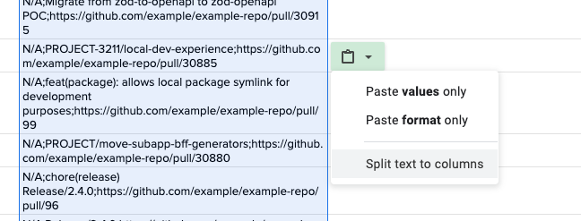

# GitHub Pull Requests Report

This Node.js script fetches your GitHub pull requests created up until the 20th day of the previous month and writes the details to a file named based on the date, such as `march-2024.txt` for pull requests fetched up until February 20th, 2024.

This script is designed to create part of your creative work monthly report based on GitHub pull requests.

## Prerequisites

1. **Node.js**: Ensure you have Node.js installed on your machine. You can download it from [nodejs.org](https://nodejs.org/).
2. **Install Dependencies**: Run the following command to install the necessary dependencies:
   ```bash
   npm install node-fetch
3. Export Your github personal access token as an environment variable:
    ```bash
    export NODE_AUTH_TOKEN=your-github-personal-access-token
    ```

## Run  

Run the script (make sure to `chmod + ./index.js` the script first):
    ```bash
    ./index.js
    ```
You can install your package globally on your workstation using npm:

```bash
npm install -g creative-work-report
creative-work-report
```

## Example output

```txt
What was created/updated/changed/added/developed?;Short description;Link to specific documentation/confirmation (for example from Confluence, Jira, pull request on Github)
N/A;Add BFF and subapp documentation;https://github.com/example/example-repo/pull/31062
N/A;chore(release): 2.9.3;https://github.com/example/example-repo/pull/122
N/A;fix(generators): BFF and Subapp generators fix;https://github.com/example/example-repo/pull/121
N/A;Reflect generator changes in examples apps;https://github.com/example/example-repo/pull/233
N/A;Bump example-package to 2.9.2;https://github.com/example/example-repo/pull/208
N/A;chore(release): 2.9.0;https://github.com/example/example-repo/pull/116
N/A;fix(generators): Distinguish schema between BFF and Subapps;https://github.com/example/example-repo/pull/115
N/A;refactor: make logger's now() use Date proto directly;https://github.com/example/example-repo/pull/170
N/A;Distinguish schema between BFF and Subapps - proposition;https://github.com/example/example-repo/pull/165
N/A;fix(generators): remove redundant baseIoc appContext container;https://github.com/example/example-repo/pull/111
N/A;PROJECT-3211/local-dev-experience;https://github.com/example/example-repo/pull/143
N/A;PROJECT/bootcamp-cleanup-el;https://github.com/example/example-repo/pull/142
N/A;PROJECT-3147/bump-typescript;https://github.com/example/example-repo/pull/30918
N/A;Migrate from zod-to-openapi to zod-openapi POC;https://github.com/example/example-repo/pull/30915
N/A;PROJECT-3211/local-dev-experience;https://github.com/example/example-repo/pull/30885
N/A;feat(package): allows local package symlink for development purposes;https://github.com/example/example-repo/pull/99
N/A;PROJECT/move-subapp-bff-generators;https://github.com/example/example-repo/pull/30880
N/A;chore(release) Release/2.4.0;https://github.com/example/example-repo/pull/96
N/A;Release/2.4.0;https://github.com/example/example-repo/pull/94
N/A;refactor(generators): Update generators;https://github.com/example/example-repo/pull/93
N/A;Bootcamp cleanup;https://github.com/example/example-repo/pull/78
N/A;PROJECT-3194/bootcamp-common-refactor;https://github.com/example/example-repo/pull/30830
N/A;PROJECT-3194/bootcamp-ui-components;https://github.com/example/example-repo/pull/30808
N/A;PROJECT/link-fix;https://github.com/example/example-repo/pull/30761
N/A;Bootcamp---Create-and-use-basic-components-test;https://github.com/example/example-repo/pull/30677
N/A;PROJECT-3167/Subapp-generator-fixes;https://github.com/example/example-repo/pull/30588
N/A;test;https://github.com/example/example-repo/pull/30585
N/A;PROJECT-3021/bootcamp-day-4-doc-update;https://github.com/example/example-repo/pull/30558
N/A;Create handler instance with configuration;https://github.com/example/example-repo/pull/30545
N/A;PROJECT-3021/bff-common-parts-db;https://github.com/example/example-repo/pull/30544
```

## How to paste this to a Google Spreadsheet 

Just copy-paste it from the file, click on this icon and select "Split text to columns" and then select proper delimiter (comma)


